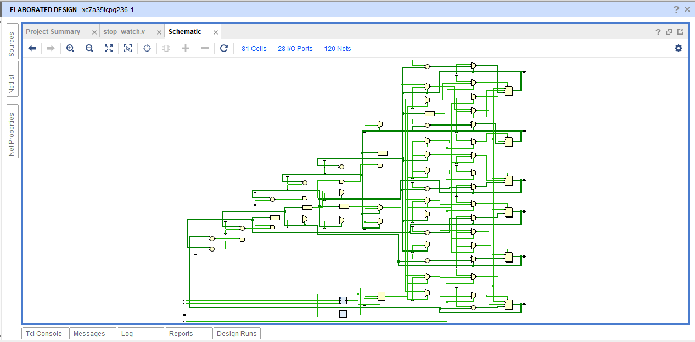
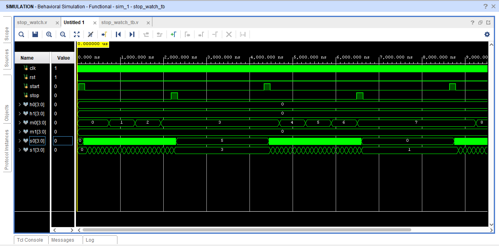
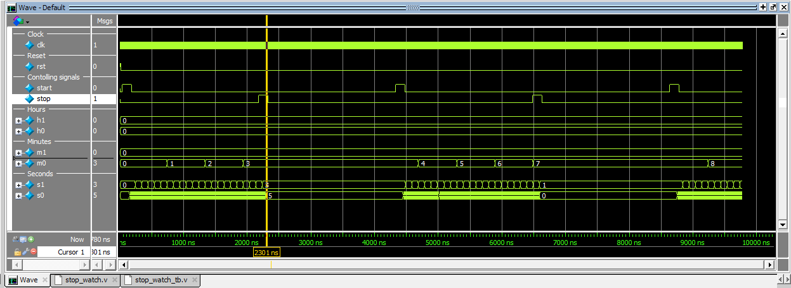

# Digital Stopwatch Using Verilog HDL

## Overview

This project presents the RTL design and functional verification of a Digital Stopwatch using Verilog HDL. The stopwatch is designed using sequential digital logic and cascading counter architecture to display hours, minutes, and seconds.

The design incorporates dedicated start, stop, and reset controls for dynamic timing operation. Debounce logic is additionally implemented to eliminate unwanted signal transitions caused by push button bouncing and to ensure stable control response.

The complete design is verified through simulation using Vivado and ModelSim.

---

## Features

- Sequential logic based stopwatch design
- Cascading counter architecture
- Hours, minutes, and seconds time display
- Start, stop, and reset functionality
- Debounce-controlled button operation
- Hold and resume timing functionality
- Rollover condition handling
- RTL design and simulation verification

---

## Technologies Used

- Verilog HDL
- Sequential Digital Logic
- Vivado
- ModelSim

---

## Project Files

- `stop_watch.v` – Main stopwatch RTL design
- `debounce.v` – Debounce module for stable button input handling
- `stop_watch_tb.v` – Verilog testbench for simulation and verification
- `Stop_watch.pdf` – Complete project documentation
- `Stop_watch_schematic.png` – RTL schematic output
- `Stop_watch_vivado_sim.png` – Vivado simulation waveform
- `Stop_watch_Modelsim_sim.png` – ModelSim simulation waveform

---

## Design Methodology

The stopwatch is implemented using cascading sequential counters for seconds, minutes, and hours progression. Enable control logic is used to manage start and stop operations dynamically.

Debounce modules are integrated to stabilize push button inputs and eliminate unwanted switching noise during control signal operation.

The overall architecture demonstrates sequential timing behavior, rollover handling, and synchronized counter operation.

---

## RTL Schematic

---

## Vivado Simulation Results

---

## ModelSim Simulation Results

---

## Verification

The stopwatch functionality is verified using a dedicated Verilog testbench in both Vivado and ModelSim simulation environments. The verification process confirms correct start, stop, reset, hold, restart, and rollover operations under different timing conditions.

---

## Future Scope

- FPGA implementation for real-time hardware operation
- Seven-segment display integration
- Lap timing functionality
- Countdown timer implementation
- Advanced debounce optimization
- Improved modular counter architecture

---

## Author

Priya Nageswari Karanam
